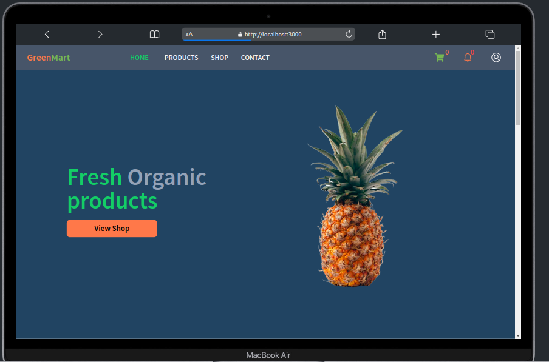
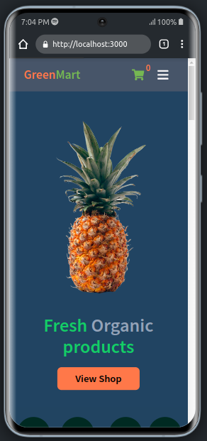

# Hero Section
This is the Hero section of our project, designed to showcase our fresh organic products and encourage users to explore the shop.

## Desktop view

## Mobile view

## Installation
There is no specific installation process for the Hero Section as it is a React component that can be integrated into your project like any other React component.

1. Ensure you have React set up in your project.
2. Copy the code from the Hero component.
3. Integrate the Hero component into your project's desired page.

## Usage

1. Import the Hero component into your React project.
2. Place the `<Hero />` component within the desired section of your webpage or application.
3. Customize the content and styles of the Hero section to match your project's branding and design.
