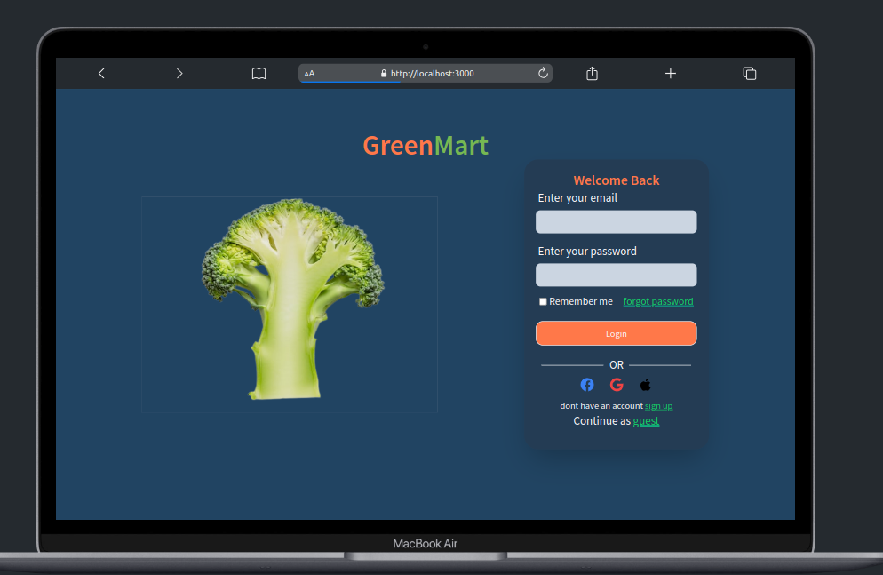
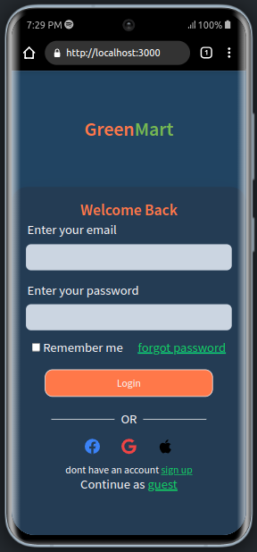

# LoginPage Component

The `LoginPage` component provides a user-friendly login interface that integrates with Firebase Authentication. Users can log in using their email and password, and have the option to log in via social media platforms like Facebook, Google, and Apple.


## Screenshots
### Desktop view

### Mobile view


## Features

### User Authentication:
 Enables users to log in using their email and password credentials.
### Social Media Login:
 Offers the convenience of logging in through Facebook, Google, and Apple accounts.
### Error Handling:
 Displays informative error messages to guide users in case of login failures.
### Remember Me: 
Provides an option for users to stay logged in by remembering their credentials.
### Forgot Password: 
Allows users to reset their password in case they forget it.
### Continue as Guest:
 Offers the choice to proceed as a guest user without logging in.


### Firebase Authentication Integration

The component integrates with Firebase Authentication to securely handle user registration. It uses the `login` function from the `useAuth` context to login to exsisting account. If any errors occur during the login process, appropriate error messages are displayed.

### Error Handling

The component includes error handling mechanisms to display meaningful error messages to users. For instance, if the user attempts to sign up with an email that is not yet registered, an error message will be shown, and the user will be prompted to try again or log in.

### Loading and Button States

To provide a smooth user experience, the sign-up button has different states. While the login process is in progress, the button will be disabled and show a loading spinner. This prevents users from submitting the form multiple times and ensures that the application's state is accurately represented to the user.

### Social Login Options

Users have the option to sign up using their existing social media accounts, such as Facebook, Google, or Apple. These options provide convenience and familiarity for users who may prefer to use their existing credentials.

## Usage

1. Install the necessary dependencies using `npm install` or `yarn install`.

2. Import the `LoginPage` component into your project:

```jsx
import SignUp from './path/to/Login';
```

3. Use the SignUp component within your application, placing it where you want the sign-up form to appear:

```jsx
<LoginPage>
```

